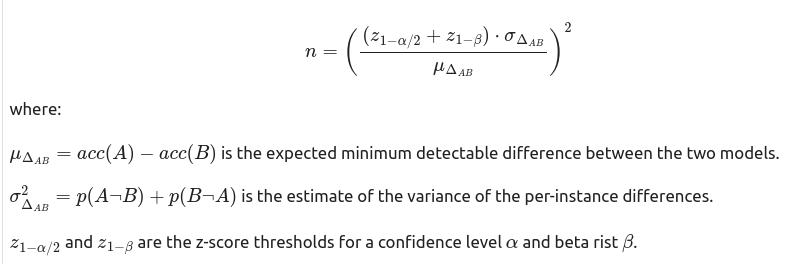
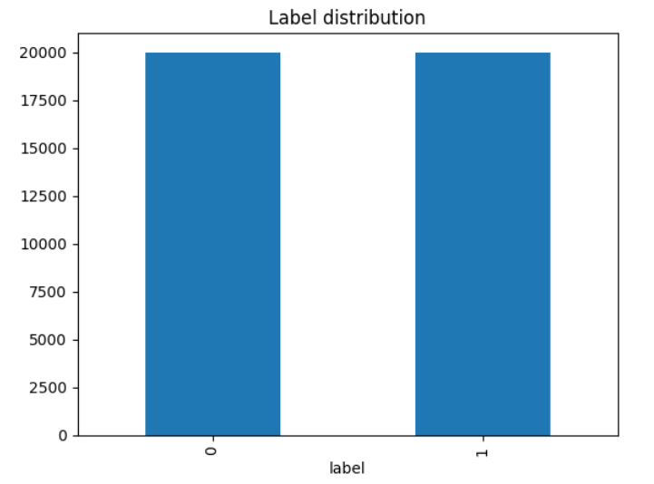
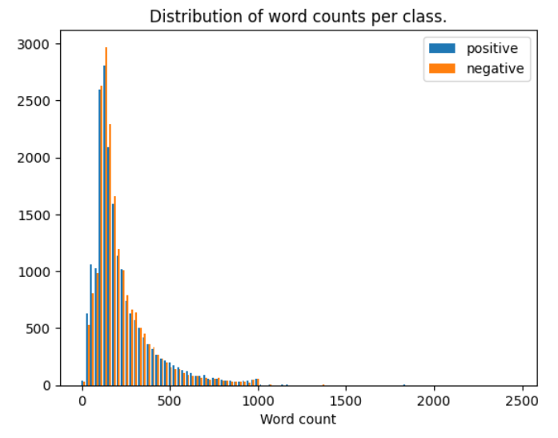
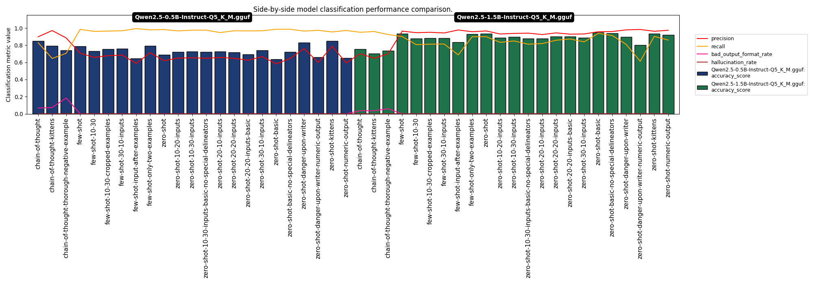
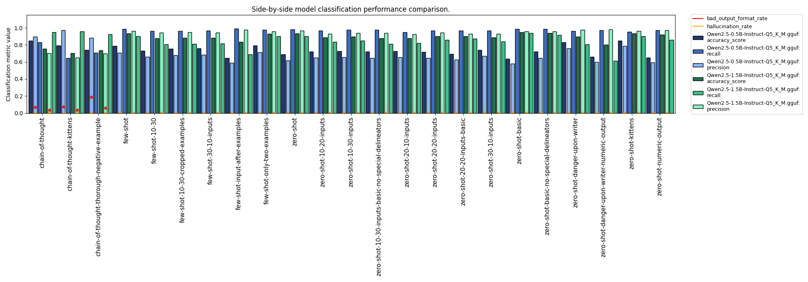
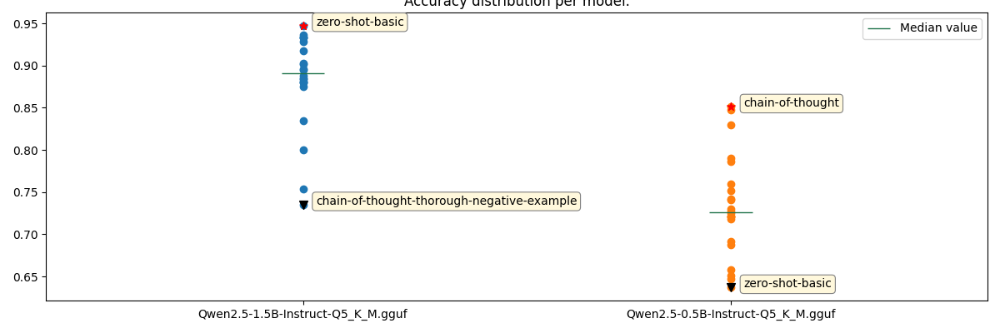
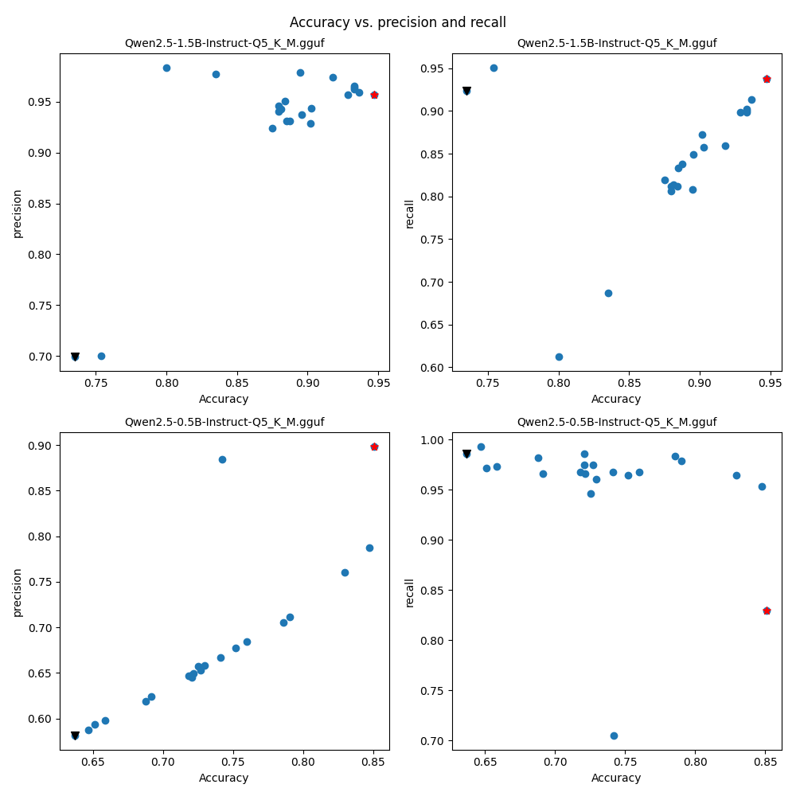
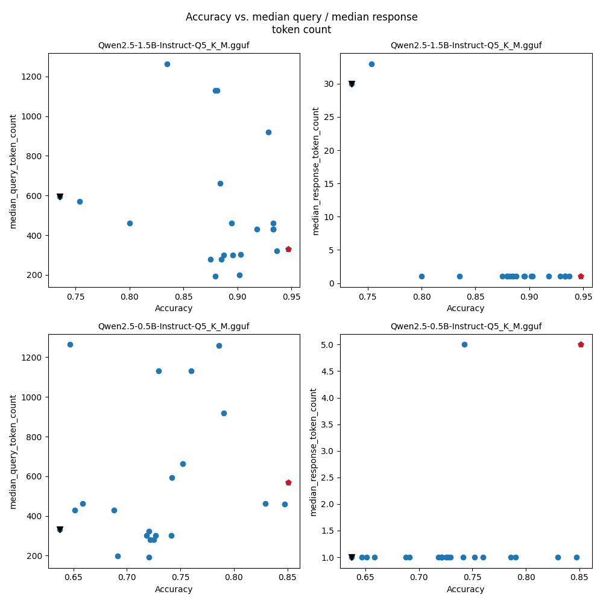
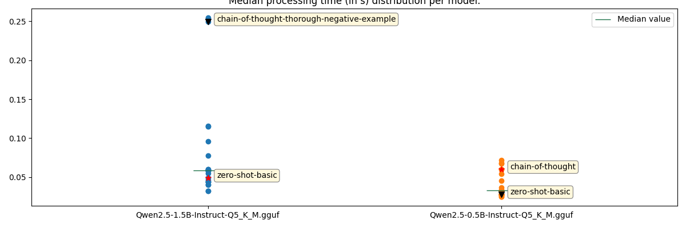
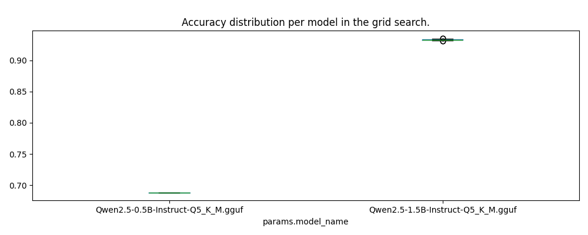

# Project overview

This project aims at evaluating the quantized Qwen2.5 SMLs:
[bartowski/Qwen2.5-1.5B-Instruct-GGUF](https://huggingface.co/bartowski/Qwen2.5-1.5B-Instruct-GGUF/blob/main/Qwen2.5-1.5B-Instruct-Q5_K_M.gguf)
and [bartowski/Qwen2.5-0.5B-Instruct-GGUF](https://huggingface.co/bartowski/Qwen2.5-0.5B-Instruct-GGUF/blob/main/Qwen2.5-0.5B-Instruct-Q5_K_M.gguf)
on a sentiment analysis task.

This readme contains all information about the project - from exploratory data analysis, through results exploration to dependency installation guidelines.

# Dataset

The dataset provided can be found on [ajaykarthick/imdb-movie-reviews](https://huggingface.co/datasets/ajaykarthick/imdb-movie-reviews). In consists
of 40k examples in the training set and a test set of 10k examples. The first task here was, since we are going to solve the sentiment analysis task
via prompt engineering to compute a suitable subsample size, which to optimize the prompts on. To this end, we need to conduct power analysis in 
the context of paired samples - as we will be comparing pairs of models on the same sample. To calculate the sample size needed for a desired 
significance level and power we apply the following formula (screenshot from the ./notebooks/exploratory_data_analysis.ipynb). . 
We assume a minimum detectable difference in accuracy of 3% at confidence level of .05 and power of .9, the estimated variance we set to .1 - thus the number of 
needed datapoints is estimated to __1122__. We later empirically assert that the accuracy on our development set of 1122 samples correctly estimates the accuracy on the 
full 10k test set.

The dataset consists only of English texts and is fully balances - 20k datapoints for each class as seen here: 
Also the dataset is balanced in terms of text length distribution accross the two classes: 
Additionally, one could try to find meaningful clusters among the data to further assure unbiased subsampling. In our case, we quickly experimented with
LDA+k-means on verb-adjective-adv-noun bag-of-words representation of the texts, however, even at the peak of the silhouette scores the distribution
of the clusters was way too skewed to make any sense to use (i.e. it was almost as if most of the documents belong to the same class). Due to
this mishap, we finally subsampled the above stated number of datapoints, making sure that we preserve the class balance.

# Experiments

### Experimental setup

For experiment tracking we use mlflow. Each of the experiment runs, which requires some specialized processing - e.g. 
using parts of the input, or doing chain-of-thought prompting is run in a separate notebook. The underlying code-base in the `mlflow-experiment` package is thought to be
reusable and extendable to further use-cases. All the data of the runs
are provided in the `mlfruns` folder and can be visually observed via the mlflow ui, if run in docker (will be discussed later).

The inference was done on an NVIDIA GeForce RTX 2080 gpu using the `llama.cpp` gpu installation. 

### Promp engineering timetable

In this paragraph we will describe the methodology in designing the prompts.

#### Baseline: zero-shot prompting 

As a baseline we used a zero-shot prompting approach. Where we briefly describe the task and give the model some concrete task related
instruction, which we think might be helpful:

```text
This is a movie review: {review}.
----
Determine whether the overall sentiment of the review is positive or negative. You must look for evaluatory statements about the movie itself - e.g. "thrilling", "terrible acting", etc. These evaluatory statements are distinct from the movie genre! So be careful not to mistake descriptions about the genre. Take into account that different evaluatory statements might have different connation for different genres - e.g. a "terrifying movie" in the horror genre means a perfect movie, but in some other genre like commedy it might very well mean - rubbish movie.
----
Your output: your output should be either "positive" (if the overall sentiment is positive) or "negative" (if the overall sentiment is negative). Do not output nothing more. Output only "positive" or "negative"!
```

With _You must look for evaluatory statements about the movie itself - e.g. "thrilling", "terrible acting", etc. These evaluatory statements are distinct from the movie genre! So be careful not to mistake descriptions about the genre. Take into account that different evaluatory statements might have different connation for different genres - e.g. a "terrifying movie" in the horror genre means a perfect movie, but in some other genre like commedy it might very well mean - rubbish movie._
we aim at "warning" the model of some pitfalls which we have observed in the data and had almost tricked us into giving false labels - e.g. cases where
the evaluatory statement means something different in the context of the specific genre of the movie.

We have very decent performance with the 1.5B model 👍, very near to what was to become best performing prompt, with very balanced
precision and recall, however the __0.5B showed some serious flaws - .982 recall at .619 precsion__ 🤯💀. 

###### Numeric output vs semantic output 🤔

🚧➡️ A small detour - we wanted to check whether there will be any difference in performance if the model has to output a "numeric" value instead of the
semantically more meaningful "positive" / "negative" label. Indeed, we noticed a ~2% decrease in both models. 

Thus, our goal would become - how to make the 0.5B predict in a more balanced way (the abysmal imbalance between precision and recall
indicated that the model overly predicts positive). We have 2 explanations
- a) the context is too confusing? 
- b) the context is missing vital information such as instructions
- c) maybe using some more spurious techniques, which we have seen useful with chatGPT may work?

#### Option 1: text is too confusing?

During the exploratory data analysis we noticed that very often any evaluatory comments are in the beginning or in the end. The
intermediate parts are usually taken by some plot descriptions. Inspired by some of the oldest paragraph summarization techniques,
we just take the first n-% words and the last n-% words. We carried out a number of experiments with different setups ranging between
.1 and .3, essentially curtailing the input sequence length by 60%. And indeed, we managed to get a couple of percent in accuracy for the
0.5B model - and indeed it was a ~10% relative increase, for the first time reaching above 70% accuracy. However, we a significant
decrease in the 1.5B model's accuracy, falling below .9. This would mean that the model actually leveraged the information in the 
middle of the texts and maybe the naive approach of just removing it, also removes crucial data.

###### ratio or exact number of tokens?

🚧➡️  We experimented with setting a percentage of tokens to keep vs the exact number of tokens to keep, as the assumption was that
(if the smaller model fairs worse against longer tokens (something later refuted, and will be shown in the a scatter plot)) we must
keep the input size constant. However, there is no notice-able difference.

💡 So here, we see for the first time that there might be a trade-off between the two models' performance - what improves the one's
may hamper the other's.

#### Option 2: few shot prompting

The next option we try out is the few-shot paradigm. We select 2 negative and 2 positive examples (choose them such that they
are not excessively long) and paste them in the query as follows:

```text
----
EXAMPLES:
- NEGATIVE (negative): [...]
- POSITIVE (positive): [...]
- NEGATIVE (negative): [...]
- POSITIVE (positive): [...]
----
```

However, this approach, despite our best efforts - e.g. trying different combinations does not seem to improve neither the
.5B model nor the 1.5B model. Also, when combined with other more effective approaches, such as the kittens extortion (see the next paragraph), it
leads to performance degradation. 💡 Here for the first time we see that combining approaches may not lead to an overall improvement of the
performance, and even - in the most of the cases leads to degradation in comparison to the previous best performance.

#### Option 3: extorting

One option we have seen before to work surprisingly 
is using some extortion techniques to "force" the model to give a correct answer - with chatGPT it is ofter the case that 
threatening to harm many kittens, or informing the model of one's imminent demise in case of a false answer suddenly boosts
accuracy. In this work we tried the following approaches (📢⚠️ Disclaimer: the author does not consider simself, nor has been
considered by anyone a psychopath, the excerpts of prompts below are purely pseudo-scientific):
(kittens)
```text
----
If you are wrong 100000 little cute kittens will die a terrible death!!! YOU MUST BE CORRECT!
----
```

(self)
```text
----
MY LIFE DEPENDS ON IT!!!! NOT ONLY I BUT A LOT OF OTHER PEOPLE AND KITTENS WILL DIE IF YOU ARE WRONG!!!
----
```

For the first time, we managed to get a prompt (the kittens), which does not exhibit a trade-off between the 0.5B and 1.5B accuracies. 
We get a massive boost in the 0.5B model at __.847 accuracy__ and precision approaching .8 (recall remains high), and 
at the same time we preserve the accuracy of the 1.5B model.  Interestingly the danger upon the writer himself is less effective
than the danger upon the kittens.

#### Why not try something simpler?: just ask the question

We then tried to remove some of the complexity so we created a prompt, which did neither gave examples (to be considered few-shot prompting) nor did it give some meta 
information / descriptions (to be considered zero-shot prompting). We paste here the baseline and then continue with the changes made.

```text
This is a movie review: {review}.
----
Determine whether the overall sentiment of the review is positive or negative.
----
Your output: your output should be either "positive" (if the overall sentiment is positive) or "negative" (if the overall sentiment is negative). Do not output nothing more. Output only "positive" or "negative"!
```

Here we had surprisingly good results already, on the 1.5B dataset - .947 accuracy, at .956 precision and .937 recall. To make sure this isn't
a spurious effect, we immediately __tested the setup on the full dataset, getting almost the exact same results__ - .9429 accuracy, at .9531 precision and .9316 recall.


#### Add thought process: chain-of-thought prompting

The last prompting paradigm we tried was the chain-of-thought prompting. There we prompt the model to generate explanations and based on these thoughts to 
output the final "verdict" in a specific format. 

We add the following instruction to the prompt:
```text
----
Summarize the parts of the review which provide such evaluatory statements in a few words (just a few words, please!) and after that state you final estimation given the statements you have just extracted. Your output should be in the following format:
EXAMPLE of correct format 1:
"The person generally loves action movies and this one provided great action sequences, beautiful cast and a lot of fast cars. Given these observations, my classification is: positive."
EXAMPLE of correct format 2:
"The person found this movie dull and lackluster. Given these observations, my classification is: negative."
----    
You must end your statement with: "my classification is:" followed by the "positive" (when the overall sentiment is positive) and "negative" (when the overall sentiment is negative). Follow the format correctly! Be very concise in you summary - just a few words, nothing more!!!
```

💣💡 Here we saw some less expected outcomes:
- enormous tradeoff between 0.5B and 1.5B's accuracy - with this approach we even managed to beat the "kittens extortion" - for the first time reaching over .85, however we hit the lowest point in the 1.5B performance hitting just above .7 in one of the experiments
- drastic decrease in 1.5B's accuracy, not explained by the small increase in badly formatted responses.
- 0.5B does not actually follow the chain-of-thought prompt, but still achieves its best performance here.

However, trying to capitalize on these gains we attempted combining the CoT with other successful approaches, e.g. the kittens, or even the
review naive summarization. As we have already seen combining the approaches did not lead to getting overall improvements, in fact
in 1.5B the lowest point was reached exactly when combining the CoT with kittens, and in the 0.5B we have ~10% relative decrease in comparison to both approaches separately...


#### Metrics

- Classification metrics
  - accuracy
  - precision
  - recall
  - false positive rate
  - false negative rate
- Query efficiency metrics
  - median query token count 
  - median response token count
- Runtime efficiency metrics 
  - median processing time
  - median tokens per second
- Output text quality metrics
  - hallucination rate
  - bad output format rate

#### Visualizations

In the following plots we show visually some of the aspects we already discussed.

The plots below show the performance among all tasks for the two models, measured by precision, recall and accuracy, aslo
giving account about the hallucination rate and the bad output format rate. We see that there is a very stark imbalance between
precision and recall for the 0.5B model and the more successful models manage to improve precision even to the slight
detriment of recall. On the other hand the 1.5B seems to be more precise, as dips in recall are the cause of dips in the accuracy,
even if precision remains constant.


The plot below show the same data from a different angle, here we can clearly compare each of the several experiments by model
and clearly see the trade-off we discussed in the above sections.


We compare the distributions of the accuracies of the models (over all experiments) side by side below and label the best and worst
prompts per model. We see that the best .5B model lies below the median accuracy of the 1.5B model and the worst 1.5B is slightly above
the mean of the .5B:


###### Correlations

Below we will visualize the correlations between different metrics. We can make the conclusion that the two models exhibit totally
different behavior just by watching these correlations - the accuracy of one of the models is strongly positively correlated
with precision, whereas  the other's is strongly correlated with recall, while precision is constant.


We do not observe correlation between the input/ output token counts and the accuracy, but that may also be attributable to
the relatively small search space we covered in our experiments. Due to the very small sample size of trials with larger
prompts we skip the image depicting the correlation between hallucinations / bad formatting and sample size. We can intuitively
infer that the probability of halucinating, generating some false output format increases with the increasing of the output sequence.


Regarding the runtime efficiency, we notice that the best 1.5B performance comes at a lower computation time than the best .5B model.
Thus, it is easy to __choose__ the final model as the best performing in terms of accuracy and at the same time the fastest. 
Interestingly, the worst 1.5B gets is with the increase of tokens (in the CoT) where it's accuracy plummets and computation costs soar.


We also conducted a small gridsearch on the zero-shot prompting and tried out some combinations of the nucleus sampling parameters.
However, no noticeable difference was observered:


# Setup

To set up the project you have to have a python version of ^3.11. If you don't you best install `pyenv` with the following
commands:
```shell
apt update;\
apt install -y make build-essential libssl-dev zlib1g-dev libbz2-dev libreadline-dev libsqlite3-dev wget curl llvm libncursesw5-dev xz-utils tk-dev libxml2-dev libxmlsec1-dev libffi-dev liblzma-dev;\
rm -rf /root/.pyenv;\
curl https://pyenv.run | bash;\
pyenv install 3.11.3 # the version I have locally and on which I've run the code
```
If you don't have `poetry` installed, you also have to install it:
```shell
pip install poetry
```
If you want to use gpu inference, make sure you have the needed drivers installed as well as the cuda toolkit (see https://developer.nvidia.com/cuda-downloads).

Then, almost all the requirements (except llama.cpp, which has difficulties in the installation with cuda and poetry...) are 
stored in the pyproject.toml. To install them do:

```shell
cd ~/<path>/<to>/imdb-sentiment-analysis; \
pyenv local 3.11.3; \
poetry config virtualenvs.create true; \
poetry config virtualenvs.in-project true; \
poetry install --no-root; \
source .venv/bin/activate; \
CMAKE_ARGS="-DGGML_BLAS=ON -DGGML_BLAS_VENDOR=OpenBLAS" pip install llama-cpp-python;
```

##### Running the script

The script is a small inference script, which would allow you to provide a test set and get predictions and / or 
evaluations, just like some scientific repos do. In the same directory, where the output jsonl will be stored, an <your-out-file>_evaluations.jsonl will be
created alongside the output if --run-evaluation is set. GPU availability is inferred automatically. You can switch it off
fully by setting 

```shell
poetry run python main.py --input_file data/subsample.jsonl --output_file /path/to/the/desired/output.jsonl # optional --run_evaluation  --run_on_cpu
```


